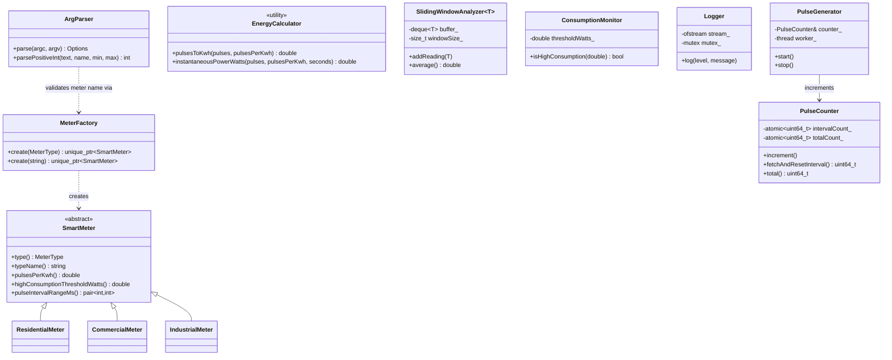
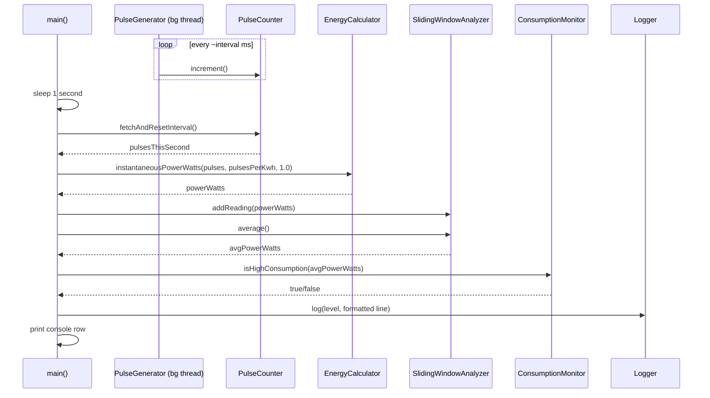
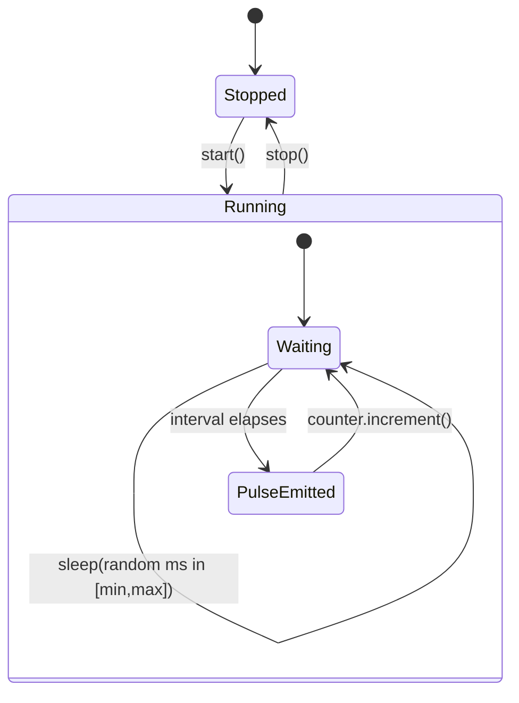
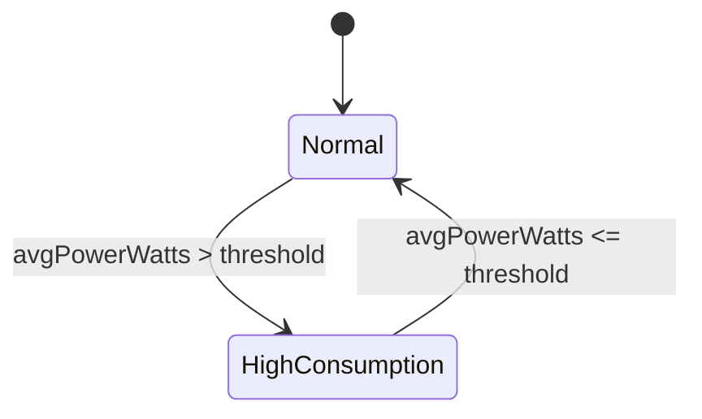

# Stage 3 — System Design & Architecture

## Overall architecture

This project has two independent, individually-verified components, not one
monolithic pipeline:

```
(A) Userspace analytics pipeline (C++17, fully tested)
------------------------------------------------------
 you
  │  ./pulsetrack --meter=residential --duration=60
  ▼
[MeterFactory]        → builds the requested SmartMeter (Factory Pattern)
  ▼
[PulseGenerator]       (background thread) → simulates pulses
  ▼
[PulseCounter]         (thread-safe, atomic)  → reads/counts pulses
  ▼
[EnergyCalculator]     → pulses → energy (kWh) → instantaneous power (W)
  ▼
[SlidingWindowAnalyzer<double>] → recent average power
  ▼
[ConsumptionMonitor]   → flags HIGH CONSUMPTION vs normal
  ├──► console output (live, formatted table)
  ▼
[Logger]               → timestamped log file


(B) Kernel-space pulse source (C, compile-verified)
----------------------------------------------------
 kernel timer (softirq, every 500ms, stands in for a hardware IRQ)
  ▼
 spinlock-protected pulse counter (pulsemeter_driver.c)
  ▼
 /dev/pulsemeter character device (read-and-clear semantics)
  ▼
 read_meter.c  → open()/read()/close() syscalls → prints pulse count
```

**(A) and (B) are deliberately not wired together at runtime in this
submission.** Swapping (A)'s in-process `PulseGenerator` for a source that
reads `/dev/pulsemeter` instead is a real, natural extension point — noted
in Stage 6 as future work — rather than something rushed into the fully
tested, verified userspace pipeline under this timeline. Keeping them
separate means a change to one can never put the other's verified behavior
at risk.

## Components and responsibilities

| Component | Responsibility |
|---|---|
| `SmartMeter` + subclasses | Hold the physical constants (pulse rate, threshold) that distinguish meter types. |
| `MeterFactory` | Construct the correct `SmartMeter` subclass from a type name or enum. |
| `PulseGenerator` | Simulate pulses on a background thread; own that thread's lifecycle (RAII). |
| `PulseCounter` | Thread-safe accumulation of pulses, both per-interval and cumulative. |
| `EnergyCalculator` | Stateless conversion math: pulses → kWh → Watts. |
| `SlidingWindowAnalyzer<T>` | Track the last N readings and their average. |
| `ConsumptionMonitor` | Compare an average reading against a threshold. |
| `Logger` | Timestamped, thread-safe append-only logging to a file. |
| `ArgParser` | The single validated entry point for all external (CLI) input. |
| `pulsemeter_driver.c` | Kernel-space char device simulating an interrupt-driven pulse source. |
| `read_meter.c` | Userspace demonstration of talking to that device via syscalls. |

## Data structures

- `std::atomic<uint64_t>` (×2 per `PulseCounter`) — lock-free concurrent counters.
- `std::deque<T>` inside `SlidingWindowAnalyzer<T>` — O(1) push-back/pop-front for a fixed-size rolling window.
- `std::unique_ptr<SmartMeter>` — sole ownership of a dynamically-selected meter subclass.
- `struct Options` — a plain validated-input value type produced once by `ArgParser` and never mutated afterward.
- Kernel side: `struct cdev`, `struct class`/`struct device` (device-model registration), `spinlock_t` + `unsigned long pulse_count` (interrupt-safe shared state), `struct timer_list` (the simulated interrupt source).

## UML diagrams

### Class diagram



### Sequence diagram (one one-second sample)



### State machine diagrams

`PulseGenerator`'s thread lifecycle (matches `start()`/`stop()` exactly):



The consumption status the monitor reports each second:



## Implementation plan

1. Core C++ library: `SmartMeter`/`MeterFactory` → `PulseCounter`/`PulseGenerator` → `EnergyCalculator` → `SlidingWindowAnalyzer` → `ConsumptionMonitor` → `Logger` → `ArgParser` → `main.cpp` wiring.
2. Automated test suite exercising every module above, including edge cases.
3. Kernel character device driver + userspace syscall client.
4. Documentation: README, this staged documentation set, UML diagrams.

This is also literally the order the Git history was built in (see below).

## Development environment and tools

- **Editor**: VS Code.
- **macOS**: Xcode Command Line Tools (`clang++`, `make`, `git`) — no VM needed for the userspace half.
- **Linux / WSL2**: `build-essential` + `linux-headers-$(uname -r)` (the latter only needed to build the kernel module).
- **Compiler**: g++/clang++, C++17, `-Wall -Wextra -Werror -Wpedantic`.
- **Verification tools**: Valgrind, ThreadSanitizer, AddressSanitizer, UndefinedBehaviorSanitizer.
- **Version control**: Git.

## Git repository and branching strategy

- `master` — always-working, release-quality state.
- `dev` — integration branch; feature branches merge here first.
- `feature/*` — one branch per module (e.g. `feature/kernel-driver`, `feature/stage-docs`), merged into `dev` with `--no-ff` so the history preserves *what was developed together*, then `dev` is merged into `master`.

This is not a diagram of an intended process — it is the actual history of
this repository; run `git log --oneline --graph --all` to see the same
branch/merge structure described above.
